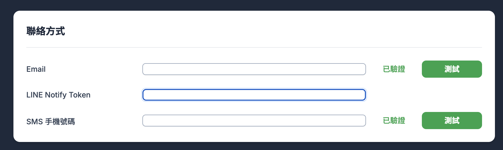
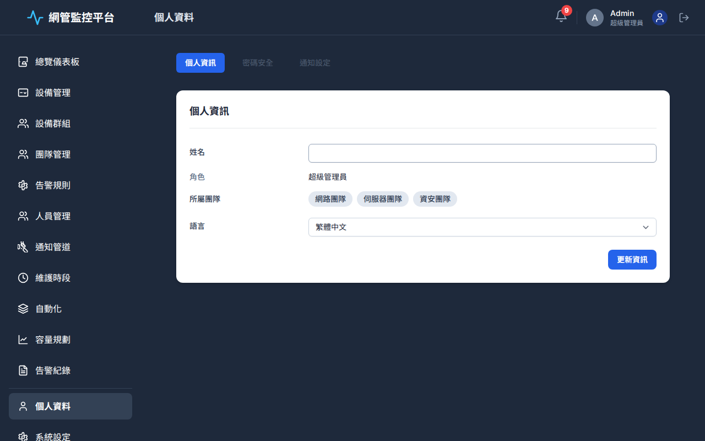
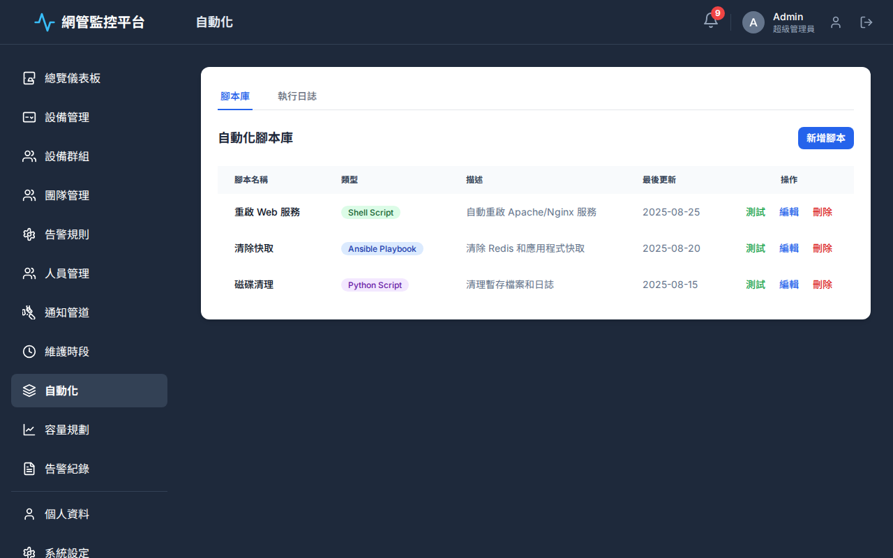

# FIXME

## 檔案為 [demo-page.html](demo-page.html)，以下問題需要解決。

- [ ]如  所示，Line Notify ，缺少了 「驗證」 按鈕。

- [ ]「個人資料」頁面的頁籤式佈局 ，改成跟自動化頁面的頁籤式佈局相同 ，符合一致的頁籤式佈局。

- [ ]「系統設定」從垂直滾動改為頁籤 (Tabs)。
	* 建立以下兩個頁籤來組織頁面內容：
			1. 整合設定	
				* Grafana 服務設定
			2. 通知設定
				* 郵件伺服器 (SMTP) 設定
				* SMS 閘道設定

- [ ]如  所示，Input 欄位 CSS，需要調整樣式(全局都應該一致)，高度需要與其他 Input 欄位一致 (例如下方「語言」欄位)，使其更清晰易讀。
