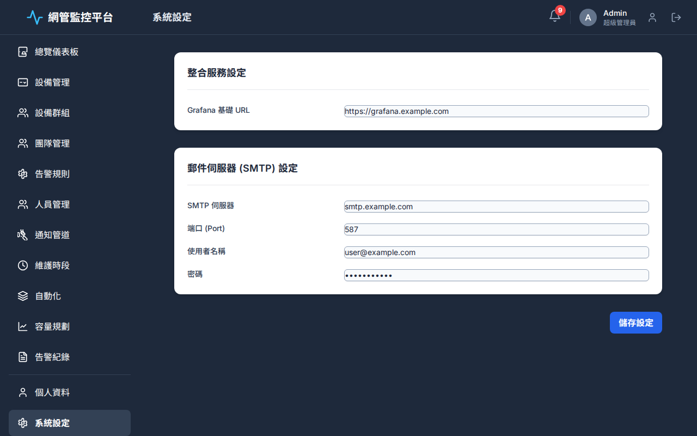
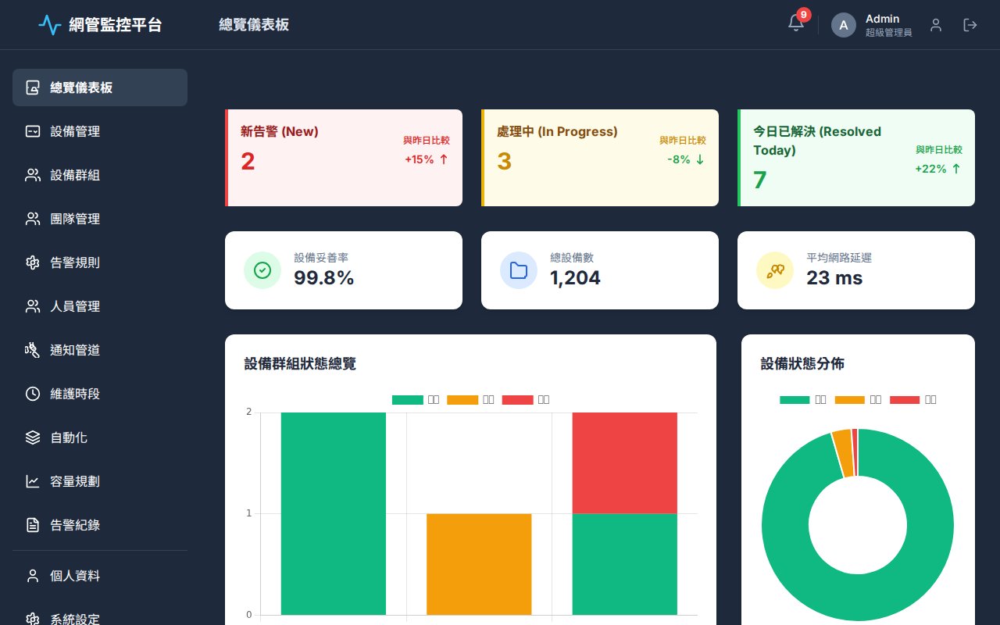

# FIXME

- [ ]如  所示，請把左下角的個人資訊區塊，移動到上方靠右位置，跟 Header Bar 齊平。

- [ ]Header Bar 的語系切換下拉選單，請改至個人資料的頁面，因為實用性不高，不需要常駐在 Header Bar 中。

- [ ]如  所示，在「系統設定」頁面中，表格裡的輸入框（Input）與背景的融合度太高，不夠突出，導致看起來不清晰。

- [ ]如  所示，「設備狀態分佈」的圖是空白，看不到任何資料，需要新增模擬資料。

- [ ]「總覽儀表板」頁面中的「設備群組狀態總覽」跟「設備狀態分佈」的圖表，改成並列式，「設備群組狀態總覽」是折線圖，位置靠左佔比 2/3，「設備狀態分佈」的圖表，是圓餅圖，位置靠右佔比 1/3。
