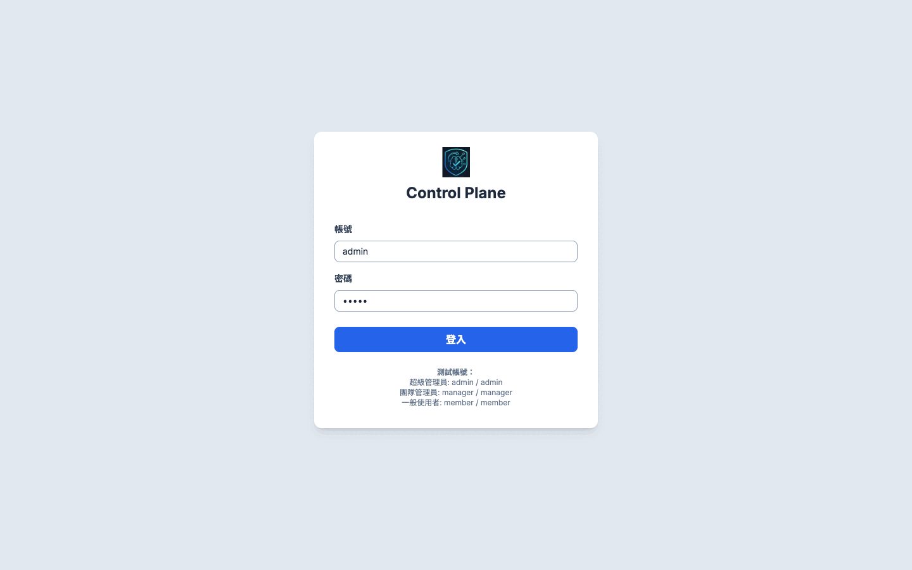

# Control Plane - 新一代自動化維運平台

## 1. 專案簡介

**Control Plane** 旨在打造一個後端驅動 (Backend-Driven) 的現代化維運平台。核心理念是將複雜性集中在 Go 後端，並使用 HTMX 保持前端的輕量與簡潔，從而無需引入大型 JavaScript 框架與其複雜的工具鏈，也能實現豐富的互動體驗。

本專案不僅是一個監控工具，更整合了 **事件驅動的自動化** 與 **數據驅動的容量規劃**，目標是從被動的故障應對，轉型為主動的系統管理。

## 功能操作展示 (GIF)

下方為本平台核心功能的操作展示動畫：



## 2. 主要功能 (Live Demo)

您可以透過 `demo-page.html` 檔案來體驗以下核心功能的即時原型。此原型直觀地展示了專案的最終 UI/UX 與核心工作流程。

*   **整合儀表板：** 一目了然地掌握系統狀態、告警狀況與關鍵效能指標 (KPI)。
*   **設備管理與批次操作：**
    *   透過複選框選擇多個設備，並執行 **批次刪除**、**加入/移出群組** 等操作。
*   **事件驅動自動化：**
    *   **腳本庫：** 管理自動化腳本 (如 Shell, Ansible)，並定義其參數。
    *   **執行日誌：** 追蹤所有自動化工作的執行歷史，方便除錯。
*   **容量規劃：**
    *   分析歷史數據以預測未來的資源使用趨勢，提前發現潛在的容量瓶頸。
*   **AI 輔助分析：**
    *   可選擇多個告警事件，透過 **Gemini AI** 生成專業的事件報告與根本原因分析 (RCA)。
*   **完全響應式設計：** 在桌面、平板與行動裝置上均提供最佳的使用體驗。

## 3. 技術棧

本專案將基於 `ARCHITECTURE.md` 中定義的以下技術棧進行開發：

*   **後端 (Backend):** Go (net/http), PostgreSQL
*   **前端 (Frontend):** HTMX, Tailwind CSS, Alpine.js
*   **核心服務 (Core Services):**
    *   **監控 (Monitoring):** VictoriaMetrics, vmagent, snmp_exporter
    *   **視覺化與告警 (Visualization & Alerting):** Grafana
    *   **身份驗證 (Authentication):** Keycloak (SSO)
    *   **AI 輔助 (AI Assistance):** Google Gemini API

## 4. 如何執行 Demo 原型

1.  將此儲存庫複製 (clone) 到您的本機電腦。
2.  在網頁瀏覽器中直接開啟 `demo-page.html` 檔案。
    *   因為是本地檔案，所以不需要額外的網頁伺服器設定。
    *   建議使用最新版的 Chrome, Firefox, Safari, 或 Edge 瀏覽器。
3.  **登入：**
    *   您可以在登入頁面使用以下任一測試帳號進行登入：
        *   **超級管理員：** `admin` / `admin`
        *   **團隊管理員：** `manager` / `manager`
        *   **一般使用者：** `member` / `member`
4.  **功能探索：**
    *   使用左側的側邊欄導航至不同的功能頁面 (如設備管理、自動化、容量規劃等)。
    *   與各頁面上的按鈕、表單、表格進行互動，體驗核心的工作流程。

## 5. 專案結構

```bash
control-plane/
├── demo-page.html         # 展示功能與 UI/UX 的互動原型
├── ARCHITECTURE.md        # 系統架構與技術規格書
├── review-availability.md # SRE Assistant 與 Control Plane 的互補性審查
├── review-docs.md         # 文件審查 (完整度、可行性評估)
└── README.md              # 專案概覽與指南 (本檔案)
```