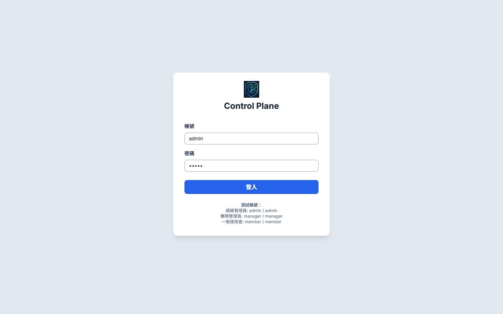
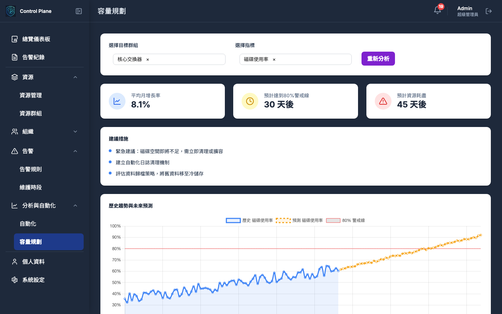

# Control Plane - 使用者指南

歡迎使用 Control Plane！本指南將引導您了解本平台的各項功能與操作方式，協助您快速上手，高效地進行系統維運與管理。

## 目錄

- [1. 核心理念](#1-核心理念)
- [2. 快速導覽](#2-快速導覽)
  - [2.1. 登入與主介面](#21-登入與主介面)
  - [2.2. 側邊導覽列](#22-側邊導覽列)
  - [2.3. 頁首功能區](#23-頁首功能區)
- [3. 儀表板 (Dashboard)](#3-儀表板-dashboard)
- [4. 資源管理 (Resource Management)](#4-資源管理-resource-management)
  - [4.1. 總覽與批次操作](#41-總覽與批次操作)
  - [4.2. 網段掃描與探索](#42-網段掃描與探索)
- [5. 組織與權限管理](#5-組織與權限管理)
  - [5.1. 人員管理 (Personnel)](#51-人員管理-personnel)
  - [5.2. 團隊管理 (Teams)](#52-團隊管理-teams)
- [6. 告警規則 (Alert Rules)](#6-告警規則-alert-rules)
- [7. 自動化 (Automation)](#7-自動化-automation)
  - [7.1. 腳本庫 (Scripts)](#71-腳本庫-scripts)
  - [7.2. 執行日誌 (Execution Logs)](#72-執行日誌-execution-logs)
- [8. 容量規劃 (Capacity Planning)](#8-容量規劃-capacity-planning)
- [9. 告警紀錄 (Logs/Incidents)](#9-告警紀錄-logsincidents)
  - [9.1. 檢視與篩選](#91-檢視與篩選)
  - [9.2. AI 輔助生成報告](#92-ai-輔助生成報告)
- [10. 通知管道 (Notification Channels)](#10-通知管道-notification-channels)
- [11. 個人資料與系統設定](#11-個人資料與系統設定)
  - [11.1. 個人資料 (Profile)](#111-個人資料-profile)
  - [11.2. 系統設定 (Settings)](#112-系統設定-settings)

---

## 1. 核心理念

Control Plane 是一個以後端驅動 (Backend-Driven) 為核心理念的現代化維運平台。我們致力於將複雜的邏輯處理集中在穩定高效的 Go 後端，並藉由 HTMX 技術，在不犧牲使用者體驗的前提下，打造一個輕量、快速且易於維護的前端介面。

## 2. 快速導覽

### 2.1. 登入與主介面

當您首次造訪平台時，系統會將您導向至統一的登入頁面。成功登入後，您將看到系統的主介面，包含了左側的「側邊導覽列」與上方的「頁首功能區」。

### 2.2. 側邊導覽列

位於畫面左側，提供全站的主要功能導覽，是您穿梭於各功能模組的主要入口。當前所在的頁面會在導覽列上以高亮樣式顯示。

### 2.3. 頁首功能區

位於畫面頂部，固定顯示，包含：
- **頁面標題**: 顯示您目前所在的功能頁面名稱。
- **通知中心**: 以鈴鐺圖示呈現，點擊可查看最新的系統通知。
- **使用者選單**: 點擊您的頭像或名稱，可進行登出或前往「個人資料」頁面。

## 3. 儀表板 (Dashboard)

### 設計目標
作為系統首頁，提供一個高層次的視圖，讓使用者能快速掌握系統的整體健康狀況與關鍵指標。

### 功能規格
儀表板是您登入後看到的第一個畫面，它以視覺化的圖表和卡片，彙整了系統當前最重要的狀態摘要。主要包含：
- **狀態趨勢卡片**: 醒目地顯示「新告警」、「處理中」、「今日已解決」的數量，並與昨日數據比較呈現增長或下降趨勢。
- **關鍵績效指標 (KPI)**: 包含「資源妥善率」、「總資源數」等核心指標。
- **圖表區**: 透過「資源群組狀態總覽」長條圖與「資源狀態分佈」圓餅圖，讓您能快速從宏觀角度掌握整體系統的健康度。

## 4. 資源管理 (Resource Management)

### 設計目標
提供對所有監控資源的集中管理、探索與高效的批次操作能力。

### 4.1. 總覽與批次操作

此頁面集中呈現了所有受監控的資源列表。您可以透過搜尋功能快速找到特定資源，並查看其基本資訊與狀態。為了提升管理效率，我們提供了強大的批次操作功能：
- **表格增強**: 資料表格的每一行前方提供一個 **複選框 (Checkbox)**，表頭處提供「全選/取消全選」功能。
- **動態操作欄**: 當使用者勾選任一資源後，表格頂部會動態出現一個「批次操作欄」，顯示已選取的項目數量，並提供「批次刪除」、「批次加入群組」與「批次移出群組」等按鈕。

### 4.2. 網段掃描與探索

除了手動新增資源，您還可以透過「掃描網段」功能，自動探索網路中的未知資源。
- **非同步掃描**: 使用者輸入 CIDR 格式的網段（如 192.168.1.0/24）後，後端將執行非同步掃描任務。
- **結果匯入**: 掃描完成後，使用者可在結果列表中勾選需要匯入的資源，實現批次新增。

## 5. 組織與權限管理

### 設計目標
將此頁面重新定位為純粹的「組織與權限」管理功能，移除所有個人化設定，並讓管理者能定義團隊，設定當團隊需要被通知時，應該由誰來接收訊息。

### 5.1. 人員管理 (Personnel)

- **功能規格**:
  - **權限管理**: 在「新增/編輯人員」的彈出視窗中，管理者僅能設定與組織權限相關的欄位：姓名 (Name)、角色 (Role)、團隊歸屬 (Team Membership)。
  - **職責分離**: 所有個人化的聯絡方式與通知偏好，皆已移至使用者自己的「個人資料」頁面進行管理。彈出視窗的介面會明確提示管理者此點。

### 5.2. 團隊管理 (Teams)

- **功能規格**:
  - **訂閱者管理**: 在「新增/編輯團隊」的彈出視窗中，核心功能是管理該團隊的「通知訂閱者 (Subscribers)」。
  - **統一選擇器**: 提供一個統一的搜尋框，讓管理者可以從「所有人員」和「所有通知管道」中，選擇多個項目作為此團隊的訂閱者。這實現了將告警同時發送給特定人員和特定管道 (如 Slack) 的靈活性。

## 6. 告警規則 (Alert Rules)

### 設計目標
讓管理者能定義觸發告警的條件、客製化告警訊息，並可選擇性地綁定自動化修復動作。

### 功能規格
您可以針對特定的「資源群組」自訂告警觸發的條件。點擊「新增規則」後，會彈出一個整合式的設定視窗。

- **摺疊式介面 (Accordion Interface)**: 「新增/編輯告警規則」的彈出視窗採用摺疊式介面設計，將「基本設定」、「自動化響應」與「通知內容自定義」分門別類，提升資訊組織性與易用性。
- **自動化響應整合**:
  - 在「自動化響應」區塊中，提供一個下拉選單，可從「腳本庫」中選擇一個預先定義好的腳本。
  - 當選擇腳本後，會動態顯示輸入框，用於將告警事件的標籤 (Labels) 映射為腳本的參數。
- **通知內容自定義**:
  - 在「通知內容自定義」區塊中，提供 `自訂標題` 與 `自訂內容` 兩個欄位。
  - 支援變數模板功能，允許使用者插入如 `{{ .ResourceName }}`、`{{ .MetricValue }}` 等變數。

## 7. 自動化 (Automation)

### 設計目標
建立一個事件驅動的自動化引擎，讓系統在偵測到特定告警時，能自動執行預設的腳本，實現秒級的故障響應。

### 功能規格
此頁面包含兩個子頁籤：

- **腳本庫 (Scripts)**: 提供介面讓管理者可以上傳、編輯、刪除自動化腳本（如 Shell Script, Ansible Playbook），並定義腳本需要的輸入參數。

- **執行日誌 (Execution Logs)**: 顯示所有自動化腳本的歷史執行紀錄，包含觸發事件、執行時間、狀態與結果，方便追蹤與除錯。

## 8. 容量規劃 (Capacity Planning)

### 設計目標
從被動的告警響應，轉向主動的資源規劃。透過分析歷史數據，預測未來資源的消耗趨勢，提前發現潛在的容量瓶頸。

### 功能規格
- **輸入**: 頁面頂部提供下拉選單，讓使用者選擇一個「資源群組」與一個關鍵效能指標（如 平均 CPU 使用率、總磁碟空間使用率）。

- **輸出**: 選擇完畢並執行分析後，頁面會顯示以下結果：
  - **關鍵預測指標**: 以卡片形式呈現，例如：「預計將在 **45 天後** 達到 80% 警戒線」、「平均每月增長率： **5.2%**」。
  - **趨勢圖**: 一張由 Chart.js 繪製的圖表，同時包含過去的歷史數據趨勢線與基於演算法預測的未來趨勢線。

## 9. 告警紀錄 (Logs/Incidents)

### 設計目標
提供一個集中、可搜尋的介面，用以查看所有歷史與當前的告警事件，並進行生命週期管理。

### 功能規格
- **進階篩選**: 提供基於時間範圍、告警等級 (高/中/低) 與處理狀態 (新、處理中、已解決) 的篩選功能。

- **事件詳情**: 點擊單筆紀錄可開啟彈出視窗，查看詳細資訊、新增處理註記、指派處理人員，並執行 Ack (確認) 或 Resolve (解決) 等操作。

- **AI 輔助報告**: 允許使用者勾選多筆關聯事件，點擊「生成事件報告」按鈕，由 Gemini AI 自動產出結構化的事件分析報告。

## 10. 通知管道 (Notification Channels)

### 設計目標
擴充通知管道的功能，使其支援多種主流服務，並提供對應的動態設定欄位。

### 功能規格
- **擴充管道類型**: 在「新增/編輯通知管道」的彈出視窗中，將「管道類型」下拉選單擴充，需包含 `Email`, `Webhook (通用)`, `Slack`, `LINE Notify`, `SMS`。

- **動態表單**: 根據使用者選擇的「管道類型」，動態變化下方的設定欄位，例如為 `Slack` 顯示 `Incoming Webhook URL` 輸入框，為 `LINE Notify` 顯示 `存取權杖` 輸入框。

## 11. 個人資料與系統設定

### 設計目標
提供使用者個人化設定與管理員系統級設定的統一入口，並導入更安全的通知設定流程。

### 11.1. 個人資料 (Profile)

- **功能規格**:
  - **頁籤式佈局**: 採用頁籤式設計，將「個人資訊」、「密碼安全」與「通知設定」清晰地劃分。
  
  - **安全的聯絡方式驗證**: 在「通知設定」頁籤中，每一個聯絡管道（Email, LINE, SMS）都擁有獨立的狀態指示器（已驗證 / 未驗證）與操作按鈕（儲存、傳送驗證、測試）。系統在發送告警時，只會將通知發送到狀態為「已驗證」的聯絡方式。
  
  

### 11.2. 系統設定 (Settings)

- **功能規格 (僅限管理員)**:
  - **頁籤式佈局**: 同樣採用頁籤式設計，劃分「整合設定」與「通知設定」。
  - **整合設定**: 包含與外部系統（如 Grafana）的串接參數。
  
  - **通知設定**: 包含系統發送通知所使用的後端服務設定（如 SMTP 伺服器、SMS 閘道）。
  
