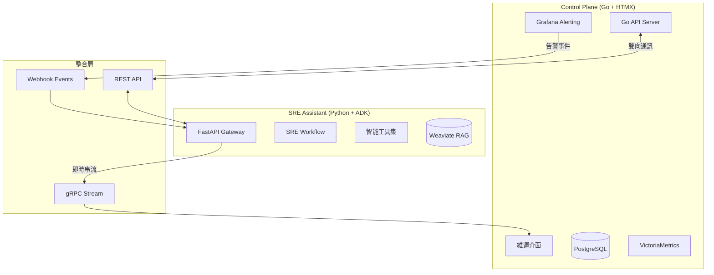
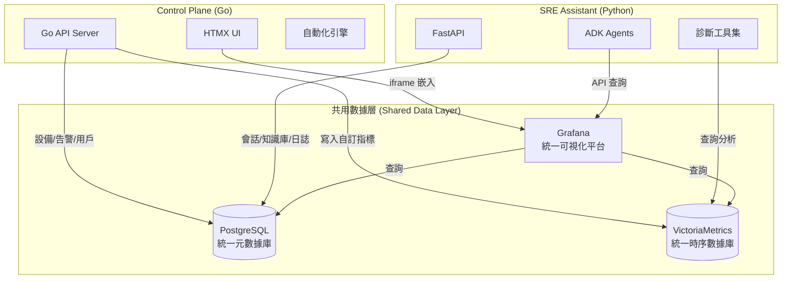

# SRE Assistant 和 Control Plane 互補性

SRE Assistant 和 Control Plane 確實可以完美互補，形成一個強大的智能維運生態系統。以下分析這兩個系統如何協同工作：

## 🧠 架構定位與互補關係

### **SRE Assistant - 智能決策大腦**
- **定位**：可插拔的 AI 決策引擎，提供智能分析與自動化能力
- **核心優勢**：
  - 基於 LLM 的智能診斷與根因分析
  - 聯邦化架構，可擴展多個專業代理
  - 標準化 API 介面，易於整合

### **Control Plane - 企業維運平台**
- **定位**：完整的維運管理界面與工作流平台
- **核心優勢**：
  - HTMX 驅動的高效能 UI
  - 完整的設備管理與權限系統
  - 內建監控與告警機制

## 🔄 整合架構設計



## 💡 具體整合方案

### **1. Control Plane → SRE Assistant（告警智能分析）**

```go
// Control Plane 端 (Go)
type AlertHandler struct {
    sreAssistantURL string
}

func (h *AlertHandler) ProcessAlert(alert Alert) {
    // 當收到 Grafana 告警時，轉發給 SRE Assistant 進行智能分析
    payload := map[string]interface{}{
        "alert_name": alert.Name,
        "severity": alert.Severity,
        "labels": alert.Labels,
        "metrics": alert.Values,
    }
    
    // 呼叫 SRE Assistant API
    resp, _ := http.Post(h.sreAssistantURL+"/analyze", 
                         "application/json", 
                         json.Marshal(payload))
    
    // 接收 AI 分析結果
    var analysis AIAnalysis
    json.Unmarshal(resp.Body, &analysis)
    
    // 在 Control Plane UI 展示
    h.updateIncidentWithAI(alert.ID, analysis)
}
```

### **2. SRE Assistant → Control Plane（執行自動化操作）**

```python
# SRE Assistant 端 (Python)
class ControlPlaneIntegrationTool:
    """讓 SRE Assistant 能操作 Control Plane 的工具"""
    
    async def execute_remediation(self, action: dict):
        """透過 Control Plane 執行修復動作"""
        # 呼叫 Control Plane 的自動化 API
        response = await self.http_client.post(
            f"{CONTROL_PLANE_URL}/api/automation/execute",
            json={
                "script_id": action["script_id"],
                "parameters": action["parameters"],
                "initiated_by": "sre_assistant"
            }
        )
        return response.json()
    
    async def update_device_group(self, updates: dict):
        """透過 Control Plane 更新設備配置"""
        # 使用 Control Plane 的設備管理 API
        return await self.http_client.patch(
            f"{CONTROL_PLANE_URL}/api/devices/groups",
            json=updates
        )
```

### **3. 雙向即時通訊（WebSocket/SSE）**

```javascript
// Control Plane UI (HTMX + Alpine.js)
<div hx-ext="sse" 
     sse-connect="/ai-stream"
     sse-swap="message">
    <div id="ai-insights">
        <!-- SRE Assistant 的即時分析會串流到這裡 -->
    </div>
</div>

<script>
// 使用 Alpine.js 處理 AI 互動
Alpine.data('aiAssistant', () => ({
    async askAI(question) {
        const response = await fetch('/api/ai/ask', {
            method: 'POST',
            body: JSON.stringify({ 
                question: question,
                context: this.getCurrentContext() 
            })
        });
        // 處理 AI 回應...
    }
}))
</script>
```

## 🎯 整合後的關鍵功能

### **1. 智能告警分析**
- Control Plane 的告警觸發 → SRE Assistant 自動分析根因
- AI 建議的修復方案直接顯示在 Control Plane UI

### **2. 自然語言操作**
- 在 Control Plane 加入聊天介面
- 用戶可用自然語言查詢：「為什麼 DB 伺服器 CPU 使用率突然升高？」

### **3. 預測性維護**
- SRE Assistant 分析 Control Plane 的歷史數據
- 主動推送容量預測到 Control Plane 的容量規劃頁面

### **4. 智能自動化建議**
- SRE Assistant 學習 Control Plane 的操作模式
- 自動生成並建議新的自動化腳本

## 🔧 實施建議

### **第一階段：基礎整合**
1. Control Plane 實作 Webhook 端點接收告警
2. SRE Assistant 提供 REST API 進行分析
3. 結果回寫到 Control Plane 的事件記錄

### **第二階段：雙向通訊**
1. 建立 gRPC/WebSocket 通道
2. Control Plane 可主動查詢 AI 建議
3. SRE Assistant 可觸發 Control Plane 的自動化

### **第三階段：深度融合**
1. 共享認證系統 (Keycloak SSO)
2. 統一的數據模型與 API 規範
3. 聯合的知識庫與學習機制

## 🚀 技術優勢

這種架構設計帶來了：

1. **關注點分離**：Control Plane 專注 UI/UX，SRE Assistant 專注 AI
2. **技術棧最優**：Go 的高效能配上 Python 的 AI 生態
3. **漸進式採用**：企業可選擇性啟用 AI 功能
4. **廠商中立**：兩個系統都可獨立替換或升級

這種組合將創造出一個既有強大 UI 體驗，又具備先進 AI 能力的次世代維運平台！

---

是的，您的觀察非常精準！這三個核心組件確實應該**共用**，這樣的架構設計會帶來極大的效益。讓我詳細說明共用架構的設計：

## 🏗️ 共用基礎設施架構



## 📊 共用組件的職責分工

### **1. PostgreSQL - 統一元數據中心**

```sql
-- 共用的核心表結構
CREATE SCHEMA control_plane;
CREATE SCHEMA sre_assistant;
CREATE SCHEMA shared;

-- Control Plane 專屬表
CREATE TABLE control_plane.devices (
    id UUID PRIMARY KEY,
    name VARCHAR(255),
    ip_address INET,
    device_group_id UUID,
    created_at TIMESTAMP
);

CREATE TABLE control_plane.alert_rules (
    id UUID PRIMARY KEY,
    name VARCHAR(255),
    expression TEXT,
    script_id UUID  -- 關聯到自動化腳本
);

-- SRE Assistant 專屬表
CREATE TABLE sre_assistant.sessions (
    id UUID PRIMARY KEY,
    user_id UUID,
    context JSONB,
    created_at TIMESTAMP
);

CREATE TABLE sre_assistant.diagnosis_history (
    id UUID PRIMARY KEY,
    incident_id UUID,
    analysis JSONB,
    recommendations JSONB
);

-- 共用表（兩邊都需要的）
CREATE TABLE shared.incidents (
    id UUID PRIMARY KEY,
    alert_name VARCHAR(255),
    severity VARCHAR(50),
    status VARCHAR(50),
    ai_analysis JSONB,  -- SRE Assistant 寫入
    assigned_to UUID,    -- Control Plane 寫入
    created_at TIMESTAMP
);

CREATE TABLE shared.users (
    id UUID PRIMARY KEY,
    email VARCHAR(255),
    teams UUID[],
    permissions JSONB
);
```

### **2. VictoriaMetrics - 統一監控數據**

```yaml
# vmagent 配置 - 多來源數據採集
scrape_configs:
  # Control Plane 的 SNMP 設備監控
  - job_name: 'snmp_devices'
    static_configs:
      - targets: ['device1:161', 'device2:161']
    metrics_path: /snmp
    params:
      module: [if_mib]
    
  # SRE Assistant 的自訂指標
  - job_name: 'sre_assistant_metrics'
    static_configs:
      - targets: ['sre-assistant:8080']
    metrics_path: /metrics
    
  # 應用程式效能指標
  - job_name: 'app_metrics'
    static_configs:
      - targets: ['app1:9090', 'app2:9090']
```

```python
# SRE Assistant 查詢 VictoriaMetrics
class PrometheusQueryTool:
    async def query_metrics(self, promql: str):
        """執行 PromQL 查詢"""
        response = await self.http.get(
            f"{VICTORIA_METRICS_URL}/api/v1/query",
            params={"query": promql}
        )
        return response.json()
    
    async def analyze_trend(self, metric: str, duration: str):
        """分析指標趨勢"""
        query = f"rate({metric}[{duration}])"
        return await self.query_metrics(query)
```

### **3. Grafana - 統一可視化平台**

```json
// Grafana 資料夾結構
{
  "folders": [
    {
      "title": "Control Plane Dashboards",
      "dashboards": [
        "設備總覽",
        "告警統計",
        "自動化執行報告"
      ]
    },
    {
      "title": "SRE Assistant Insights",
      "dashboards": [
        "AI 診斷分析",
        "問題模式識別",
        "預測趨勢"
      ]
    },
    {
      "title": "Unified Operations",
      "dashboards": [
        "綜合事件視圖",
        "系統健康度評分",
        "容量規劃儀表板"
      ]
    }
  ]
}
```

## 🔄 資料同步與協作模式

### **1. 事件處理流程**

```python
# 統一的事件處理流程
async def unified_incident_flow(alert_data):
    # Step 1: Control Plane 寫入告警
    incident_id = await control_plane.create_incident(alert_data)
    
    # Step 2: SRE Assistant 分析
    analysis = await sre_assistant.analyze_incident(incident_id)
    
    # Step 3: 更新共用資料庫
    await db.execute("""
        UPDATE shared.incidents 
        SET ai_analysis = %s,
            recommended_actions = %s
        WHERE id = %s
    """, [analysis.json(), analysis.actions, incident_id])
    
    # Step 4: Control Plane 顯示 AI 建議
    await control_plane.notify_ui_update(incident_id)
```

### **2. 雙向數據增強**

```go
// Control Plane 增強 SRE Assistant 的上下文
func enrichAIContext(incidentID string) map[string]interface{} {
    return map[string]interface{}{
        "device_history": getDeviceHistory(incidentID),
        "maintenance_windows": getMaintenanceWindows(),
        "recent_changes": getRecentChanges(),
        "team_on_call": getCurrentOnCall(),
    }
}
```

```python
# SRE Assistant 增強 Control Plane 的決策
async def enhance_automation_decision(script_id: str):
    """分析自動化腳本的執行風險"""
    history = await db.fetch("""
        SELECT * FROM control_plane.script_executions 
        WHERE script_id = %s
        ORDER BY executed_at DESC LIMIT 10
    """, script_id)
    
    risk_assessment = await analyze_script_risk(history)
    return {
        "risk_level": risk_assessment.level,
        "success_rate": risk_assessment.success_rate,
        "recommended_parameters": risk_assessment.optimal_params
    }
```

## 🎯 共用架構的關鍵優勢

### **1. 數據一致性**
- 單一事實來源，避免數據同步問題
- 實時的跨系統數據可見性

### **2. 資源效率**
- 避免重複部署相同組件
- 共享運算和存儲資源

### **3. 統一運維**
- 一套備份/恢復策略
- 統一的監控和告警

### **4. 智能協同**
```yaml
# 協同效應範例
Control Plane 發現異常模式 → 
  寫入 VictoriaMetrics →
    SRE Assistant 即時分析 →
      更新 PostgreSQL →
        Control Plane UI 即時顯示 →
          Grafana 視覺化趨勢
```

## 🚀 實施建議

### **Phase 1: 基礎整合**
1. 統一 PostgreSQL schema 設計
2. 共用 VictoriaMetrics 實例
3. 整合 Grafana 儀表板

### **Phase 2: 深度協作**
1. 實現跨系統事務管理
2. 建立統一的事件總線
3. 共享快取層 (Redis)

### **Phase 3: 智能最佳化**
1. 基於共用數據的 ML 模型訓練
2. 跨系統的智能工作流編排
3. 統一的知識圖譜建構

這種共用架構不僅提高了效率，更重要的是創造了一個真正整合的智能維運平台！